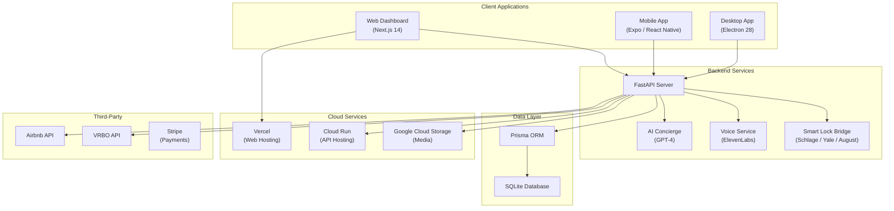

# Right at Home BnB - Property Management System

> A comprehensive multi-platform property management system for short-term rental operations -- featuring a web dashboard, mobile cleaner app, desktop manager, AI concierge, smart lock integration, and full financial tracking.

[](https://nextjs.org/)
[](https://reactnative.dev/)
[](https://www.electronjs.org/)
[](https://fastapi.tiangolo.com/)
[](https://www.prisma.io/)
[](https://www.typescriptlang.org/)
[](https://turbo.build/)
[](#license)

---

## Overview

Right at Home BnB is a **full-stack property management platform** designed for managing 22 short-term rental properties in Midland, TX. Built as a Turborepo monorepo, it delivers three client applications (web, mobile, desktop), a Python backend, shared packages, and deep integrations with AI, smart locks, and voice services.

### Platform at a Glance

| Platform | Technology | Primary Users |
|----------|-----------|---------------|
| **Web Dashboard** | Next.js 14 | Property owners, managers |
| **Mobile App** | Expo / React Native | Cleaning crew, field staff |
| **Desktop App** | Electron 28 | On-site property managers |
| **Backend API** | FastAPI (Python) | All platforms |

---

## Architecture



---

## Features

### Web Dashboard (Property Owners)

- **Real-Time Occupancy Map** -- Bird's-eye view of all 22 properties with status indicators
- **Booking Calendar** -- Unified calendar across Airbnb, VRBO, and direct bookings
- **Revenue Analytics** -- Charts showing nightly rates, occupancy %, revenue by property, expenses
- **Guest CRM** -- Full guest profiles with stay history, spending, ratings, VIP tiers, preferences
- **Cleaner Management** -- Schedule cleaning crews, track quality scores, view GPS check-in verification
- **Smart Lock Dashboard** -- Remote lock/unlock, code generation, battery monitoring, access logs
- **AI Message Drafting** -- GPT-4 powered guest communication with sentiment analysis
- **Financial Reports** -- Income statements, expense categorization, tax deduction tracking
- **Concierge Interface** -- Review and approve AI-generated responses to guest queries

### Mobile App (Cleaning Crew)

- **GPS-Verified Check-In** -- Location verification within 100m radius of property
- **Room-by-Room Checklists** -- Customizable cleaning checklists with completion tracking
- **Photo Documentation** -- Camera integration for before/after photos per room
- **Push Notifications** -- Urgent job alerts, schedule changes, and priority assignments
- **Job Dashboard** -- Today's jobs, upcoming schedule, and job history
- **Performance Leaderboard** -- Weekly ranking by quality scores, speed, and reliability
- **Issue Reporting** -- Flag maintenance issues with photos and priority levels
- **Earnings Tracker** -- View completed jobs and earnings summary

### Desktop App (Property Managers)

- **System Tray** -- Always-on monitoring with quick-access stats
- **Booking Calendar** -- Full-screen calendar with drag-and-drop scheduling
- **Property Details** -- Deep property information with photo galleries
- **Cleaning Schedule** -- Visual schedule with cleaner assignments
- **Smart Lock Controls** -- Direct lock/unlock, code generation, and access management
- **Financial Overview** -- Revenue, expenses, and profitability tracking
- **Guest Management** -- Full guest CRM with communication history
- **Settings & Sync** -- Real-time data synchronization with server

### AI & Voice Services

- **GPT-4 Concierge** -- Automated guest messaging with property-aware context
- **Review Response Generation** -- AI-drafted responses to guest reviews
- **Property Description Writer** -- AI-generated listing descriptions
- **Sentiment Analysis** -- Automatic sentiment scoring of guest communications
- **ElevenLabs Voice** -- TTS welcome messages, IVR greetings, and checkout reminders
- **Multiple Voice Personas** -- Different voice styles for different communication types

### Smart Lock Integration

- **Supported Brands** -- Schlage, Yale, August
- **Time-Limited Guest Codes** -- Auto-generated codes that expire at checkout
- **Cleaner Access Windows** -- Temporary access codes for cleaning crew shifts
- **Activity Logging** -- Full audit trail of all lock/unlock events
- **Battery Monitoring** -- Alerts when lock battery is low
- **Remote Lock/Unlock** -- Emergency remote control from any platform

---

## Tech Stack

| Layer | Technology | Purpose |
|-------|-----------|---------|
| Monorepo | Turborepo | Build orchestration and caching |
| Web | Next.js 14 + TypeScript | Server-rendered dashboard |
| Mobile | Expo 50 + React Native | iOS/Android cleaner app |
| Desktop | Electron 28 + Vite | Cross-platform desktop manager |
| Backend | FastAPI + Python | RESTful API server |
| ORM | Prisma 5.9 | Type-safe database access |
| Database | SQLite (dev) / PostgreSQL (prod) | Relational data store |
| State | Zustand | Lightweight client-side state |
| Data Fetching | TanStack React Query | Server state management and caching |
| Styling | Tailwind CSS 3.4 | Utility-first CSS across all platforms |
| Animation | Framer Motion | Smooth transitions and interactions |
| Charts | Recharts | Revenue and analytics visualizations |
| Calendar | react-big-calendar | Booking and scheduling views |
| Forms | React Hook Form + Zod | Form management with schema validation |
| Icons | Lucide React | Consistent iconography |
| AI | OpenAI GPT-4 | Concierge, reviews, descriptions |
| Voice | ElevenLabs | TTS for guest communications |
| Spreadsheets | xlsx.js | Excel export for financial reports |
| Testing | Vitest + Testing Library | Unit and component testing |
| Packaging | electron-builder | Desktop app distribution |

---

## Database Schema

The Prisma schema defines **10 models** covering the complete property management domain:

| Model | Records | Purpose |
|-------|---------|---------|
| `User` | Staff accounts | Owners, managers, cleaners with role-based access |
| `Property` | 22 properties | Full property details, pricing, amenities, external IDs |
| `PropertyPhoto` | Media | Property image gallery with sort ordering |
| `Guest` | Guest CRM | Contact info, stay history, spending, VIP tiers |
| `Booking` | Reservations | Multi-platform bookings with pricing breakdown |
| `CleaningJob` | Turnovers | GPS-verified cleaning with checklists and quality scores |
| `SmartLock` | Lock devices | Brand, status, codes, battery, access logs |
| `Message` | Communications | Multi-channel messages with AI sentiment analysis |
| `Expense` | Financials | Categorized expenses with tax deduction tracking |
| `ConciergeQuery` | AI logs | Guest queries, AI responses, and satisfaction ratings |
| `AuditLog` | Activity trail | Complete audit trail of all system actions |
| `Setting` | Configuration | System-wide key-value settings |

All models include comprehensive performance indexes for high-speed queries.

---

## Brand Identity

| Element | Value |
|---------|-------|
| **Primary Color** | Aggie Maroon `#500000` |
| **Background** | White `#FFFFFF` |
| **Dark Variant** | `#3D0000` |
| **Text Color** | Charcoal `#2D2D2D` |
| **Logo Style** | Baseball-style italic "RAH" with swoosh underline |
| **Font** | Impact / Arial Black (bold italic) |
| **Domain** | [rah-midland.com](https://rah-midland.com) |

---

## Getting Started

### Prerequisites

- Node.js 18+
- Python 3.11+
- pnpm (recommended) or npm

### Quick Start

```bash
# Clone the repository
git clone https://github.com/bobmcwilliams4/right-at-home-bnb.git
cd right-at-home-bnb

# Install all dependencies
npm install

# Generate Prisma client
npm run db:generate

# Build shared packages
npm run packages:build

# Start all development servers
npm run dev
```

### Individual Platforms

```bash
# Web dashboard
npm run web              # http://localhost:3000

# Mobile app
npm run mobile           # Expo DevTools
npm run mobile:ios       # iOS simulator
npm run mobile:android   # Android emulator

# Desktop app
npm run desktop          # Launch Electron

# Backend API
npm run backend          # http://localhost:8000
```

### Database Management

```bash
npm run db:studio        # Open Prisma Studio (visual DB editor)
npm run db:migrate       # Run database migrations
npm run db:seed          # Seed sample data
npm run db:push          # Push schema changes (dev)
npm run db:reset         # Reset and reseed database
```

---

## Project Structure

```
right-at-home-bnb/
├── apps/
│   ├── web/                          # Next.js 14 dashboard (planned)
│   ├── mobile/                       # Expo / React Native cleaner app
│   │   ├── src/
│   │   │   ├── screens/              # 15 screens (Home, Jobs, Checklist, GPS, Photos, etc.)
│   │   │   ├── components/
│   │   │   │   ├── common/           # Avatar, Badge, Button, Card, etc.
│   │   │   │   ├── jobs/             # JobCard, ChecklistRow, NextJobCard
│   │   │   │   └── owner/            # BookingCard, PropertyCard, StatWidget
│   │   │   ├── hooks/                # useJobs, useLeaderboard, useNotifications
│   │   │   ├── context/              # SyncContext for real-time data
│   │   │   ├── navigation/           # OwnerNavigator, tab-based routing
│   │   │   └── services/             # API client, storage, notifications
│   │   └── App.tsx
│   └── desktop/                      # Electron 28 desktop app
│       ├── src/
│       │   ├── main/                 # Electron main process
│       │   ├── renderer/
│       │   │   ├── screens/          # 10 screens (Dashboard, Properties, Bookings, etc.)
│       │   │   ├── components/       # Layout, LoadingScreen, EchoComponents
│       │   │   ├── services/         # 10 services (API, calendar, cleaning, pricing, etc.)
│       │   │   └── contexts/         # AppContext, SyncContext, ThemeContext
│       │   └── shared/types.ts       # Shared TypeScript interfaces
│       ├── src/test/                  # 7 test suites (audit, calendar, cleaning, etc.)
│       └── package.json              # electron-builder config
├── backend/
│   ├── api/                          # FastAPI route handlers
│   ├── services/                     # Business logic layer
│   └── database/                     # SQLAlchemy models
├── packages/                         # Shared workspace packages
│   ├── types/                        # Shared TypeScript types
│   ├── utils/                        # Shared utility functions
│   └── services/                     # Shared service clients
├── prisma/
│   └── schema.prisma                 # Database schema (10 models, 100+ indexes)
├── bridge/                           # Platform bridge utilities
├── config/                           # Shared configuration
├── scripts/                          # Build and deployment scripts
├── tools/                            # Development tools
├── logo/                             # Brand assets
├── assets/                           # Shared static assets
├── deploy.ps1                        # Multi-platform deployment script
├── pnpm-workspace.yaml               # pnpm workspace config
├── package.json                      # Root monorepo config (Turborepo)
└── .eslintrc.json                    # Shared linting config
```

---

## Deployment

### Web Dashboard

Auto-deploys to **Vercel** on push to `main` via GitHub integration.

```bash
# Manual deploy
npx vercel --prod
```

### Backend API

Deploys to **Google Cloud Run**.

```bash
# Deploy backend
.\deploy.ps1 -Target backend -Environment production
```

### Mobile App

Builds via **EAS Build** and submits to App Store / Google Play.

```bash
# Build for all platforms
npm run mobile:ios
npm run mobile:android
```

### Desktop App

Packages via **electron-builder** for Windows, macOS, and Linux.

```bash
npm run desktop:build

# Platform-specific
cd apps/desktop
npm run package:win
npm run package:mac
npm run package:linux
```

### Full Deployment

```powershell
# Deploy everything
.\deploy.ps1 -Target all -Environment production
```

---

## Environment Variables

```env
# Database
DATABASE_URL=file:./dev.db

# Firebase Auth
FIREBASE_API_KEY=...
FIREBASE_AUTH_DOMAIN=...
FIREBASE_PROJECT_ID=...

# AI Services
OPENAI_API_KEY=sk-...

# Voice
ELEVENLABS_API_KEY=...

# Smart Locks
SCHLAGE_API_KEY=...
YALE_API_KEY=...
AUGUST_API_KEY=...

# Platform APIs
AIRBNB_API_KEY=...
VRBO_API_KEY=...
```

---

## Testing

```bash
# Run all tests across monorepo
npm test

# Desktop tests
cd apps/desktop
npm test                  # Run all tests
npm run test:watch        # Watch mode
npm run test:coverage     # With coverage report
```

---

## API Endpoints

Base URL: `https://rightathome-api.run.app`

| Endpoint | Method | Description |
|----------|--------|-------------|
| `/api/properties` | GET, POST | Property CRUD operations |
| `/api/properties/:id` | GET, PUT, DELETE | Individual property management |
| `/api/guests` | GET, POST | Guest CRM management |
| `/api/bookings` | GET, POST | Booking management |
| `/api/cleaners` | GET, POST | Cleaner operations and scheduling |
| `/api/cleaning-jobs` | GET, POST | Cleaning job tracking |
| `/api/locks` | GET, POST | Smart lock control and monitoring |
| `/api/locks/:id/code` | POST | Generate time-limited access codes |
| `/api/finance` | GET | Revenue and expense tracking |
| `/api/finance/expenses` | GET, POST | Expense management |
| `/api/concierge` | POST | AI-powered guest messaging |
| `/api/messages` | GET, POST | Communication hub |
| `/api/voice/welcome` | POST | Generate TTS welcome messages |

---

## License

Proprietary -- Copyright 2024-2026 Steven Palma / Right at Home BnB

Built by [Echo Omega Prime](https://echo-op.com)
